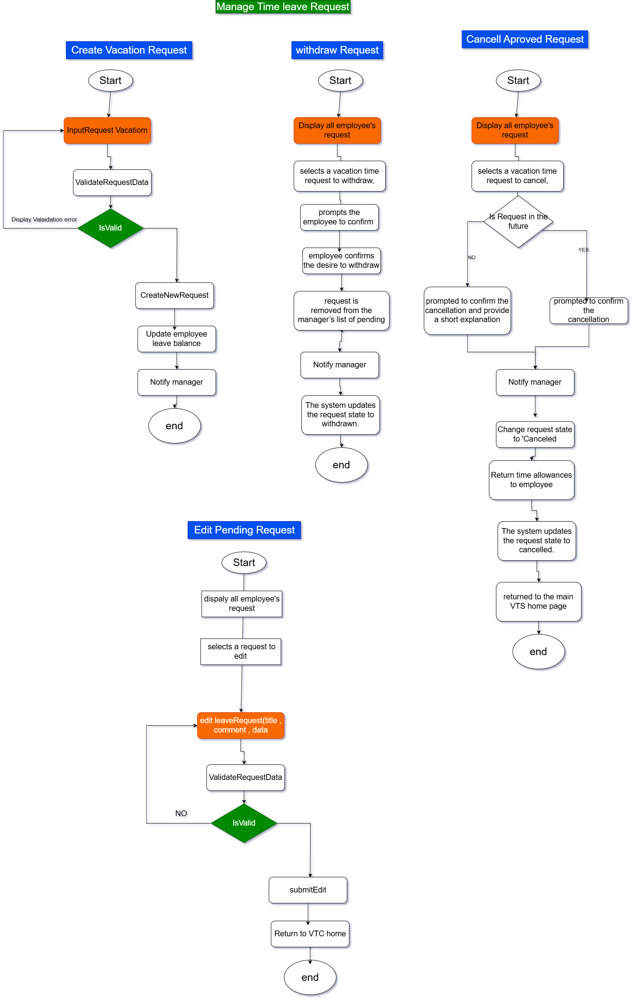
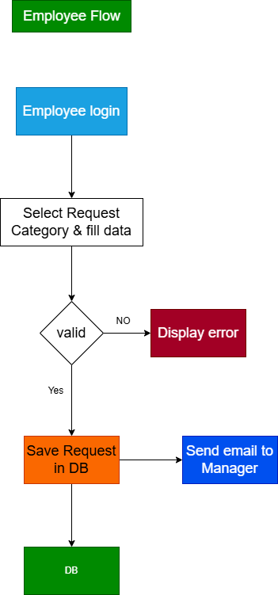
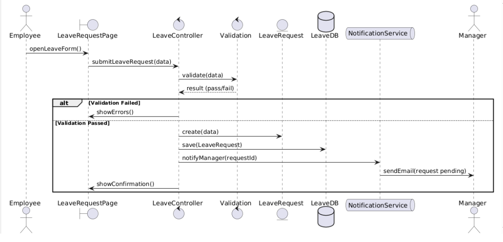
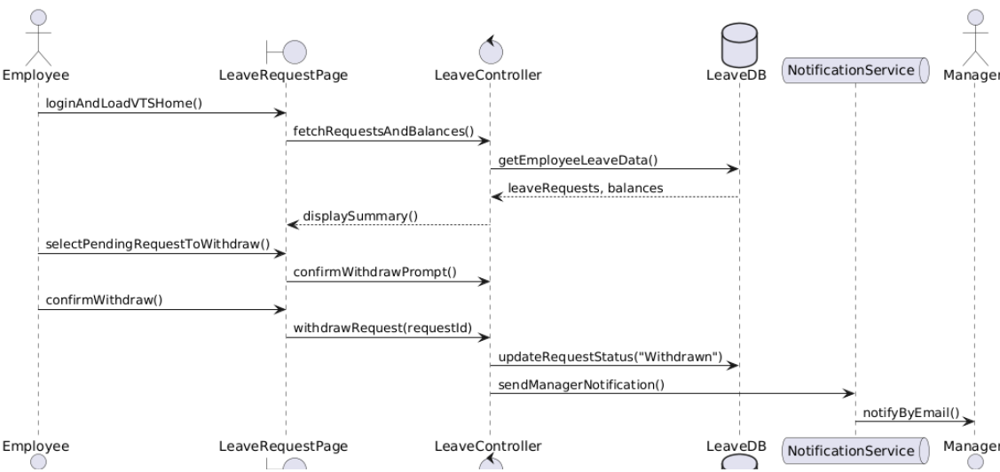
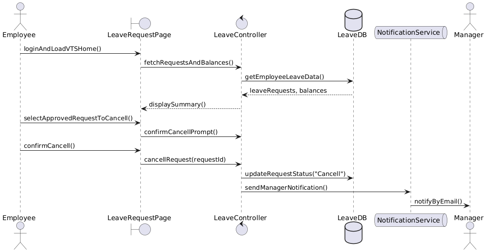
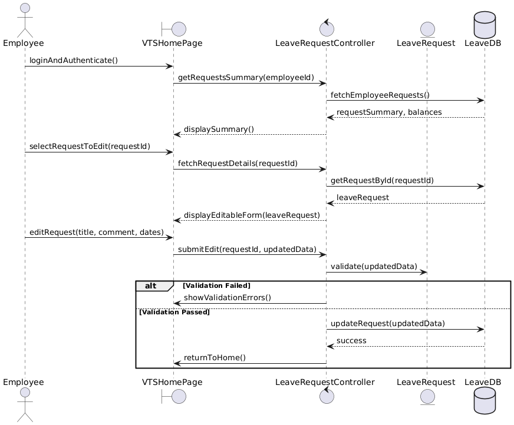

## 🎯 Vision
A Vacation Tracking System (VTS) will provide individual employees with the 
capability to manage their own vacation time, sick leave, and personal time off, 
without having to be an expert in company policy or the local facility’s leave 
policies

## 📋 Requirements
### ✅ Functional Requirements (FRs)
  
  1. Implements a flexible rules-based system for validating and verifying leave time requests.

  2. Enables manager approval (optional)

  3. Provides access to requests for the previous calendar year and allows requests to be made up to a year and a half in the future.
 
  4. Uses e-mail notification to request manager approval and notify employees of request status changes.

  5. Keeps activity logs for all transactions.
  
  6. Enables HR and system admin to override all actions, with logging.
  
  7. Allows managers to directly award personal leave time 
  8. Integration services 

### ✅ Non-Functional Requirements (NFRs)
  
  . * Uses existing hardware and middleware
    * The system must be easy to use.[usability]

  

## 🚧 Constraints

  * Integrations
  * Legacy Hardware 
  * Single-sign-on
  * User experience

## 📌 Domain [Define Problem]

 Many organizations lack an efficient and automated system to manage employee vacation requests and approvals. Manual methods or basic email-based systems lead to delays, errors, policy violations, and lack of transparency. There is a need for a centralized, web-based vacation tracking system that ensures accurate tracking, timely approvals, and policy compliance.

## 🎭 Actors:
 1. Managers
 2. Employees
 3. HR
 4. System Admin

# State Machine System
  

 
# Flow-chart
 ## 1. Manage Time
  

# use-case 
 ## 1. ManageTime (Employee , Manager)
   ### a. flow chart
    #### Employee flow
      
 
     
   ### b. sequence digrame (create Leave Request)
   

   ### b. sequence digrame (withdraw Pending Request)
   

   ### c. sequence digrame (cancel Aproved Request)
   

   ### d. sequence digrame (edit Pending Request)
   

 