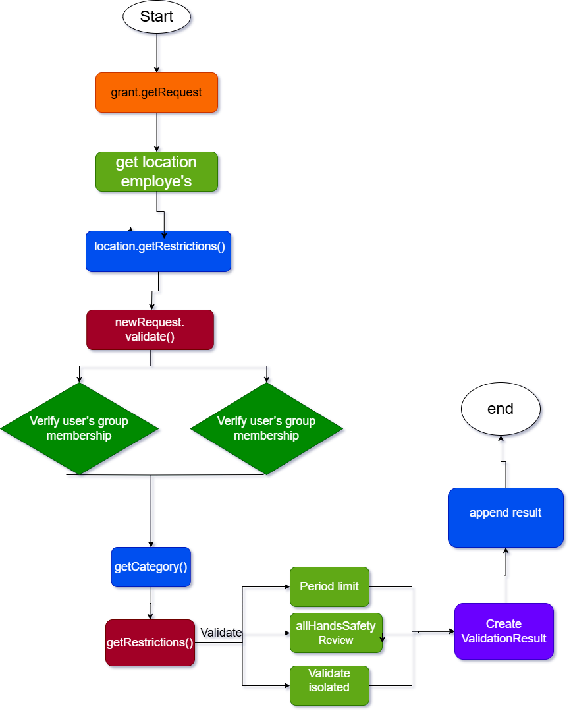

# Vacation-Tracking-System
A web-based Vacation Tracking System that helps organizations manage and monitor employee vacation requests, approvals, and balances efficiently.

## 🎯 Vision
A Vacation Tracking System (VTS) will provide individual employees with the 
capability to manage their own vacation time, sick leave, and personal time off, 
without having to be an expert in company policy or the local facility’s leave 
policies

## 📋 Requirements
### ✅ Functional Requirements (FRs)
  
  1. Implements a flexible rules-based system for validating and verifying leave time requests.

  2. Enables manager approval (optional)

  3. Provides access to requests for the previous calendar year and allows requests to be made up to a year and a half in the future.
 
  4. Uses e-mail notification to request manager approval and notify employees of request status changes.

  5. Keeps activity logs for all transactions.
  
  6. Enables HR and system admin to override all actions, with logging.

  7. Allows managers to directly award personal leave time (within system-set limits).
  
  8. Provides a Web service interface for other internal systems to query employee vacation request summaries.

### ✅ Non-Functional Requirements (NFRs)
  
  1. The system must be easy to use.
  2. The system must be accessible on both desktop and mobile devices.

## 🚧 Constraints

 1. Is implemented as an extension to the existing intranet portal system, and uses the portal’s single-sign-on mechanisms for all authentication.

 2. Interfaces with the HR department legacy systems to retrieve required employee information and changes.

 3. The system must work on both mobile and desktop with responsive design

## 📌 Domain [Define Problem]

-- Many organizations lack an efficient and automated system to manage employee vacation requests and approvals. Manual methods or basic email-based systems lead to delays, errors, policy violations, and lack of transparency. There is a need for a centralized, web-based vacation tracking system that ensures accurate tracking, timely approvals, and policy compliance.

## 🎭 Actors:
 1. Manager
 2. Employee
 3. clerk
 4. System Admin

# use-case
  1. Mange Time
  

 